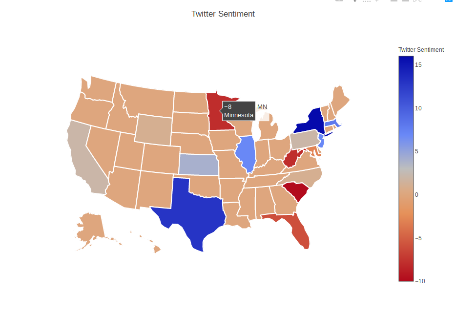

# Mapping Twitter Sentiment

Real-time twitter analysis that generates sentiment maps.  This project uses Universal Sentence Encoder embeddings and a sentiment model trained on the Sentiment140 Twitter dataset to produce sentiment labels for tweets.  These labels are tallied for each state and a sentiment map like the one below is generated.  This tool is solely intended for research purposes.


## Usage

After installing the requisite dependencies (see requirements.txt), and inserting your twitter API keys, you can run the script with your desired search term.

```python
python3 tweet_sentiment_mapper.py 'term' --geo y
```

Tweets mentioning this term will be fetched, and the sentiment labels for each tweet will be predicted by the sentiment model.  After all of this is completed, a sentiment map will be displayed in your default browser, and if the --geo flag is set, another map will be displayed in your browser that indicates the precise latitude and longitude origination of each tweet.

## Authors
Sean M Kennedy (github.com/kenneds6)

